# 功能的需求
    edge裝置外部網路可訪問設備：需要讓外部網路可以間接連接裝置
    edge裝置登入：(PS:edge裝置無法輸入文字)
        1. 藉由QRcode與UUID，讓使用者透過手機掃描登入
        2. 開機後開啟wifi基地台，並提供網址進行首次設定

    前端網頁功能：
        1. 醫師綁定受測者功能
        2. 醫師註冊功能
        3. 受測者管理(CRUD)
        4. 裝置管理功能(CRUD)(包含裝置遠程控制功能與config編輯功能)
        5. 測試結果管理(CRUD)
        6. 包含分析結果介面
            a. 受測者資訊
            b. 該次測試狀態(資料蒐集失敗(超時,裝置故障,其他),資料分析失敗(伺服器無回應,資料損毀,分析結果有誤,其他),資料分析中,資料分析成功)
            c. 如果測試為成功之輸出資訊
    
    帳號種類需求：
        1. 管理員帳號(系統維護者)
        2. 醫師帳號(裝置持有者)
        3. 受測者帳號(被測試者)

# 非功能的需求
    3分鐘內快速上手(針對一般使用者)
    後端伺服器功能需求：
        1. 後端伺服器安全性：防止csrf攻擊
        2. 前端伺服器應能乘載至少10Mb/s流量
        3. 訪問延遲小於500ms
        4. 資料庫與檔案傳輸功能
        5. edge裝置UUID綁定

    edge裝置結構需求：
        1.  柔性裝置固定器(應選用TPU-83A材料)
        2.  柔性感測器固定器(應選用TPU-95A材料+線材槽位與主體固定位)
        3.  裝置配戴應舒適
        4.  感測器不應對受測面施加超過1N應力(在合理配戴條件下)
        5.  裝置長度調整功能(100mm及以上可調整範圍，應具備足夠的韌性與強度)
        6.  免工具安裝(僅侷限於受測者使用之過程)
        7. 整體裝置淨重小於1kg，主體外殼材料應採用ASA
        8. 高可靠性，活動部件免加潤滑油(須保證高可靠性)
        9. 核心結構件選用之材料應具備至少100℃耐熱性(耐熱)，與4.9kj/m^2衝擊強度(抗摔能力)，飽和吸水率1.5%(防潮能力)，且應避免使用混CF(碳纖維增強)之材料
        10. 螺絲選用應符合各部件側向與撤回負荷之需求，並統一採用內六角螺絲
        11. 核心固定螺母應採用自鎖螺母，並禁止使用自攻螺絲，螺絲半徑至少m1.2以上，非核心固定螺母可使用內嵌螺母

    edge裝置電子器件與電路板需求：
        1.  4channel 音訊輸入功能(3接觸式麥克風+1onboard環境麥克風，採樣率16bit以上，應使用I2S)
        2.  2channel 音訊輸出功能(1接觸式喇叭+1普通喇叭)
        3.  加速度感測器(檢測裝置位移等資訊)
        4.  使用者互動裝置(onboard按鈕(使用者操作)與onboard LED燈(綠黃紅色))
        5. 快速拆裝(裝置安裝時間小於1分鐘，僅侷限於受測者使用之過程)
        6. 電池續航至少2小時並具備5V2.1A至少30秒之峰值供電能力
        7. 平台具備基本算力 (最小4GB EMMC,512MB DDR2 RAM)(PCB應選用FR-4級以上規格)
        8. 裝置充電需支持PD20w，QC3.0及以上規格之充電(充電接口使用Type-C)
        9. 附帶之電源供應器應支持 100-240 VAC， 50/60 Hz輸入，最大20w輸出功率
        10. wif需支援iEEE 802.11 b/g/n及以上 (頻率範圍無限制，應符合NCC規範)
        11. 每次測試失敗率小於10000ppm (不包含環境與設備損壞之狀況)
        12. (PCB)主版與副板連接線應至少選用24AWG以上之線徑，非音訊之感測器應採用PH2.0端子(XH2.54應避免使用)所有線材連接處應進行絕緣處理(端子除外)
  
# 功能分解圖(edgeGUI)
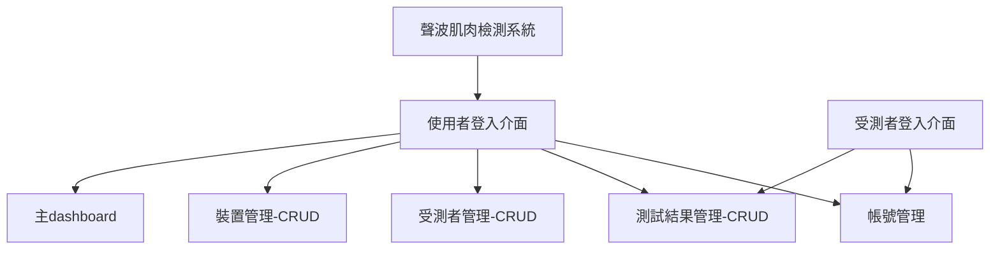
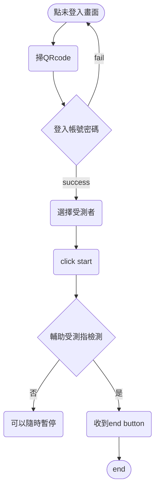
# 功能順序圖(WebUI)
### WebUI使用者登入：

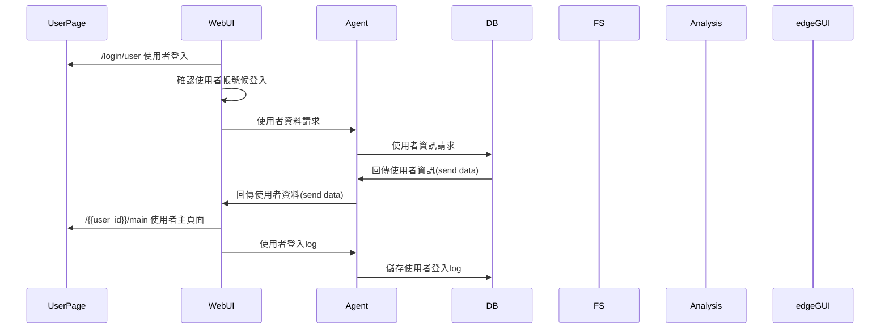

---

### WebUI受測者page：

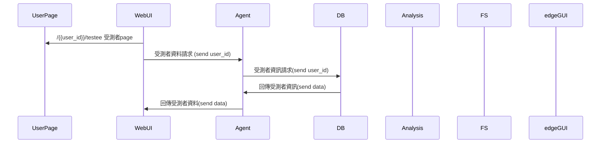

---

### WebUI添加受測者：

link：

- [WebUI受測者page：](https://www.notion.so/WebUI-page-5fdd8d1ebbde48218223c065637705cf?pvs=21)

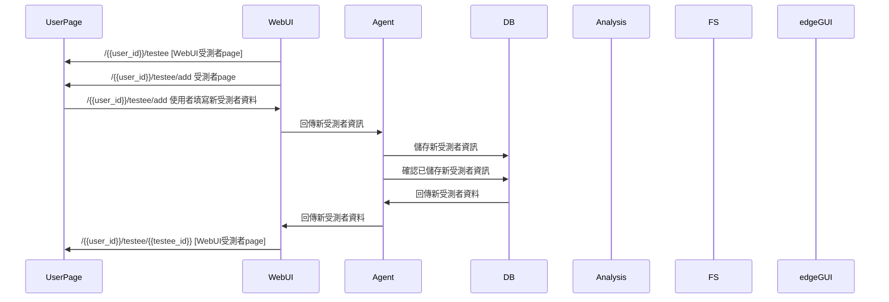

---

### WebUI 查詢測試結果(總覽)：

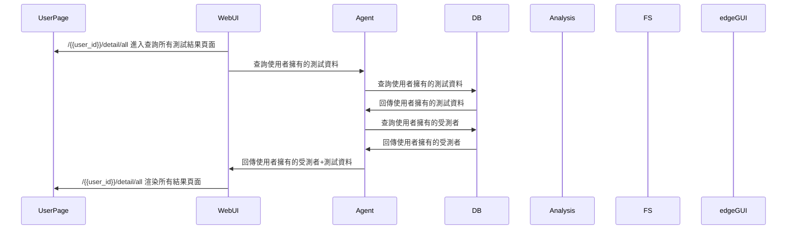

---

### WebUI 查詢測試結果(細節)：

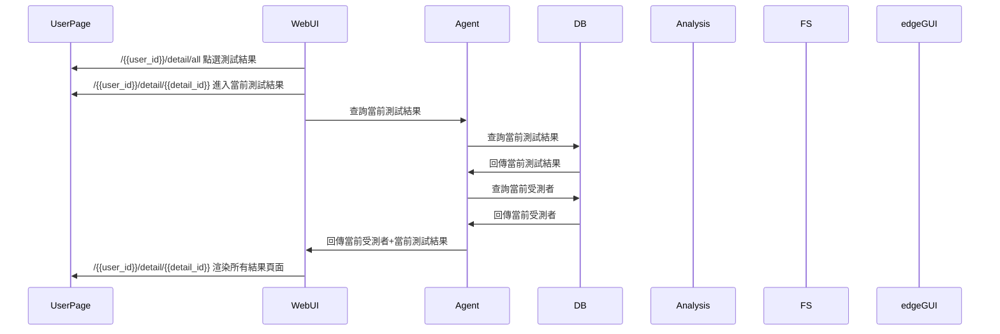

---

### edgeGUI啟動：

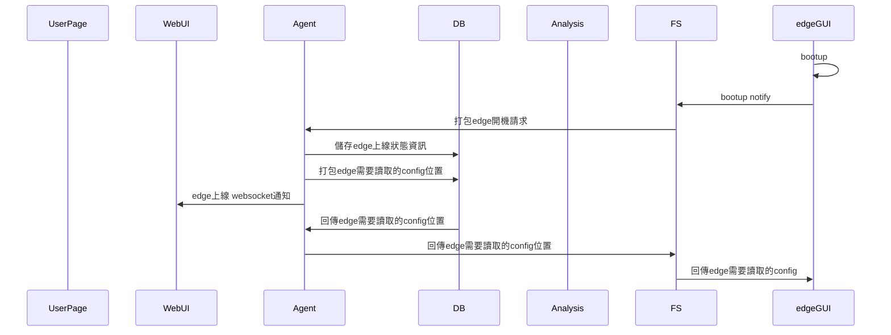

---

### edgeGUI登入：

Note: 可以部份沿用WebUI使用者登入

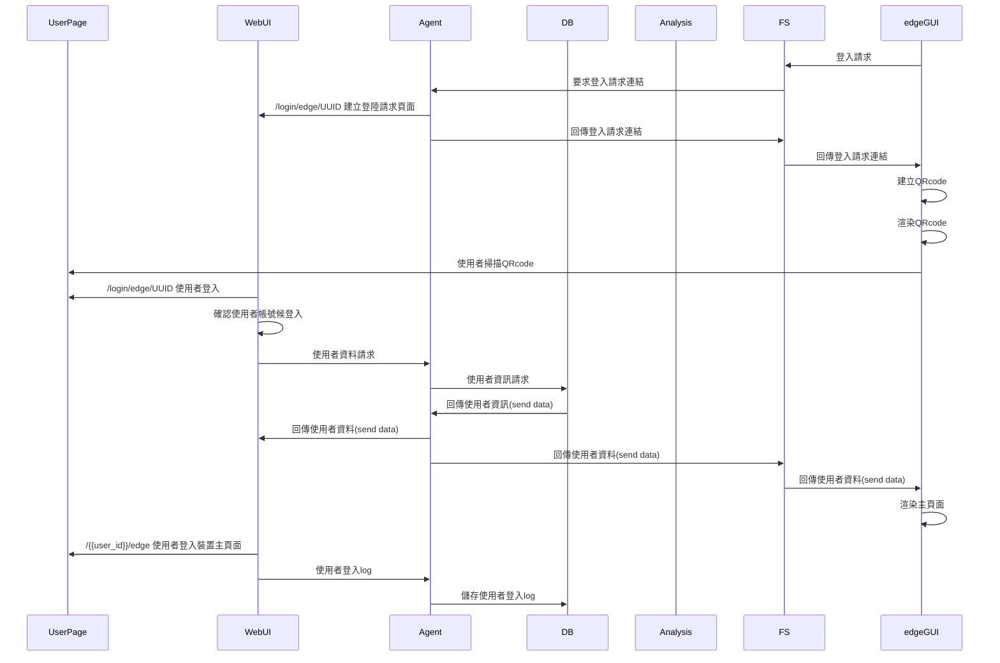

---

### edgeGUI結果查詢：

Note: 可以部份沿用WebUI使用者登入

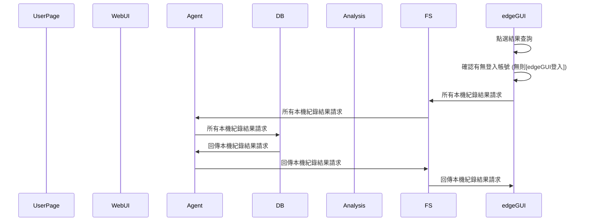

---

### edgeGUI開始實驗：

link:

- [edgeGUI登入：](https://www.notion.so/edgeGUI-0d1772ae04554b73890852595d6088c6?pvs=21)

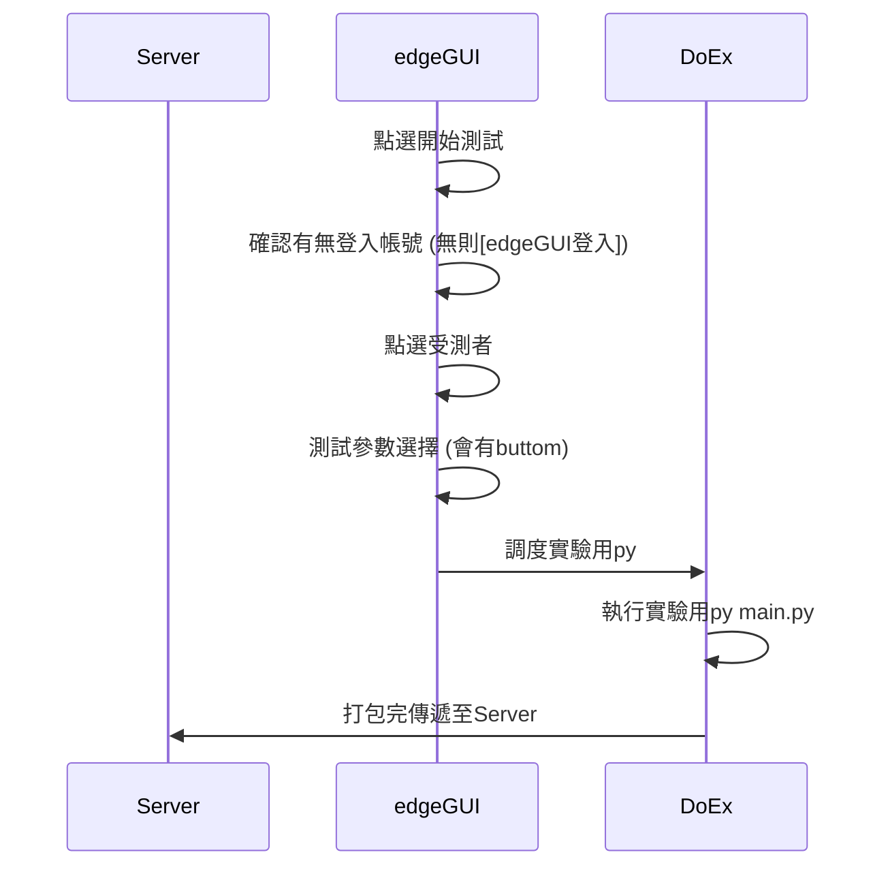

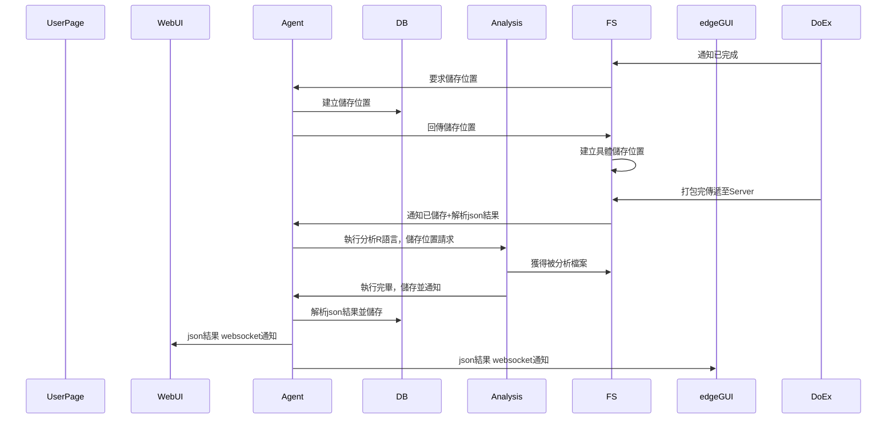

# 需求分析的文字描述
    使用者登入介面：使用者(醫生)登入的介面
    受測者登入介面：受測者登入的介面
    帳號管理：編輯個人帳號資料，註銷帳號
    主dashboard：各種圖表與其他頁面的連結介面
    測試結果管理-CRUD：測試結果管理(包含查詢，編輯，刪除，創造)
    裝置管理-CRUD：裝置管理管理(包含查詢，編輯，刪除，創造)
    受測者管理-CRUD：受測者管理管理(包含查詢，編輯，刪除，創造)
# 使用案例圖
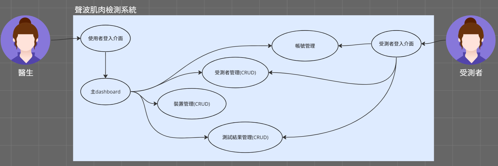
# Figma (圖片可連結至fimga)
[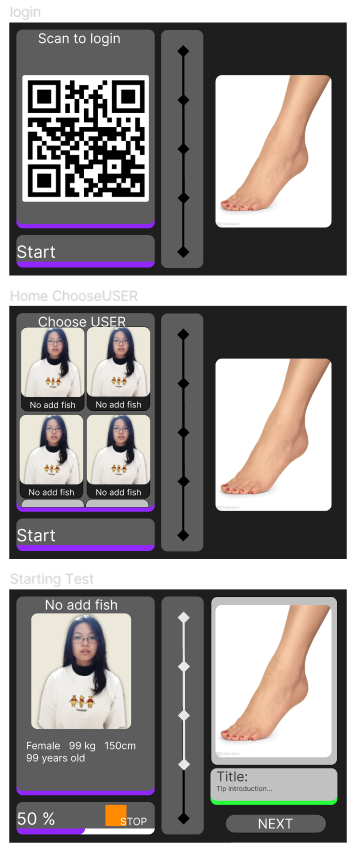](https://www.figma.com/proto/gFt7ZukLwP9aXmlx4ROww5/%E5%B0%88%E9%A1%8CGUI%E4%BB%8B%E9%9D%A2?node-id=7-140&scaling=scale-down&page-id=0%3A1)# 功能的需求
    edge裝置外部網路可訪問設備：需要讓外部網路可以間接連接裝置
    edge裝置登入：(PS:edge裝置無法輸入文字)
        1. 藉由QRcode與UUID，讓使用者透過手機掃描登入
        2. 開機後開啟wifi基地台，並提供網址進行首次設定

    前端網頁功能：
        1. 醫師綁定受測者功能
        2. 醫師註冊功能
        3. 受測者管理(CRUD)
        4. 裝置管理功能(CRUD)(包含裝置遠程控制功能與config編輯功能)
        5. 測試結果管理(CRUD)
        6. 包含分析結果介面
            a. 受測者資訊
            b. 該次測試狀態(資料蒐集失敗(超時,裝置故障,其他),資料分析失敗(伺服器無回應,資料損毀,分析結果有誤,其他),資料分析中,資料分析成功)
            c. 如果測試為成功之輸出資訊
    
    帳號種類需求：
        1. 管理員帳號(系統維護者)
        2. 醫師帳號(裝置持有者)
        3. 受測者帳號(被測試者)

# 非功能的需求
    3分鐘內快速上手(針對一般使用者)
    後端伺服器功能需求：
        1. 後端伺服器安全性：防止csrf攻擊
        2. 前端伺服器應能乘載至少10Mb/s流量
        3. 訪問延遲小於500ms
        4. 資料庫與檔案傳輸功能
        5. edge裝置UUID綁定

    edge裝置結構需求：
        1.  柔性裝置固定器(應選用TPU-83A材料)
        2.  柔性感測器固定器(應選用TPU-95A材料+線材槽位與主體固定位)
        3.  裝置配戴應舒適
        4.  感測器不應對受測面施加超過1N應力(在合理配戴條件下)
        5.  裝置長度調整功能(100mm及以上可調整範圍，應具備足夠的韌性與強度)
        6.  免工具安裝(僅侷限於受測者使用之過程)
        7. 整體裝置淨重小於1kg，主體外殼材料應採用ASA
        8. 高可靠性，活動部件免加潤滑油(須保證高可靠性)
        9. 核心結構件選用之材料應具備至少100℃耐熱性(耐熱)，與4.9kj/m^2衝擊強度(抗摔能力)，飽和吸水率1.5%(防潮能力)，且應避免使用混CF(碳纖維增強)之材料
        10. 螺絲選用應符合各部件側向與撤回負荷之需求，並統一採用內六角螺絲
        11. 核心固定螺母應採用自鎖螺母，並禁止使用自攻螺絲，螺絲半徑至少m1.2以上，非核心固定螺母可使用內嵌螺母

    edge裝置電子器件與電路板需求：
        1.  4channel 音訊輸入功能(3接觸式麥克風+1onboard環境麥克風，採樣率16bit以上，應使用I2S)
        2.  2channel 音訊輸出功能(1接觸式喇叭+1普通喇叭)
        3.  加速度感測器(檢測裝置位移等資訊)
        4.  使用者互動裝置(onboard按鈕(使用者操作)與onboard LED燈(綠黃紅色))
        5. 快速拆裝(裝置安裝時間小於1分鐘，僅侷限於受測者使用之過程)
        6. 電池續航至少2小時並具備5V2.1A至少30秒之峰值供電能力
        7. 平台具備基本算力 (最小4GB EMMC,512MB DDR2 RAM)(PCB應選用FR-4級以上規格)
        8. 裝置充電需支持PD20w，QC3.0及以上規格之充電(充電接口使用Type-C)
        9. 附帶之電源供應器應支持 100-240 VAC， 50/60 Hz輸入，最大20w輸出功率
        10. wif需支援iEEE 802.11 b/g/n及以上 (頻率範圍無限制，應符合NCC規範)
        11. 每次測試失敗率小於10000ppm (不包含環境與設備損壞之狀況)
        12. (PCB)主版與副板連接線應至少選用24AWG以上之線徑，非音訊之感測器應採用PH2.0端子(XH2.54應避免使用)所有線材連接處應進行絕緣處理(端子除外)
  
# 功能分解圖(edgeGUI)


# 功能順序圖(WebUI)
### WebUI使用者登入：


---

### WebUI受測者page：


---

### WebUI添加受測者：

link：

- [WebUI受測者page：](https://www.notion.so/WebUI-page-5fdd8d1ebbde48218223c065637705cf?pvs=21)


---

### WebUI 查詢測試結果(總覽)：


---

### WebUI 查詢測試結果(細節)：


---

### edgeGUI啟動：


---

### edgeGUI登入：

Note: 可以部份沿用WebUI使用者登入

```mermaid
sequenceDiagram
    participant UserPage
    participant WebUI
    participant Agent
    participant DB
    participant Analysis
    participant FS
		participant edgeGUI
    edgeGUI->> FS:登入請求
    FS->> Agent:要求登入請求連結
		Agent->> WebUI:/login/edge/UUID 建立登陸請求頁面
    Agent->> FS:回傳登入請求連結
    FS->> edgeGUI:回傳登入請求連結
    edgeGUI->> edgeGUI:建立QRcode
    edgeGUI->> edgeGUI:渲染QRcode
    edgeGUI->> UserPage:使用者掃描QRcode

    WebUI->> UserPage: /login/edge/UUID 使用者登入
		WebUI->> WebUI: 確認使用者帳號候登入
		WebUI->> Agent: 使用者資料請求
		Agent->> DB: 使用者資訊請求
		DB->> Agent: 回傳使用者資訊(send data)
		Agent->> WebUI: 回傳使用者資料(send data)
		Agent->> FS: 回傳使用者資料(send data)
		FS->> edgeGUI: 回傳使用者資料(send data)
    edgeGUI->> edgeGUI:渲染主頁面
    WebUI->> UserPage: /{{user_id}}/edge 使用者登入裝置主頁面
		WebUI->> Agent: 使用者登入log
		Agent->> DB: 儲存使用者登入log
		

```

---

### edgeGUI結果查詢：

Note: 可以部份沿用WebUI使用者登入

```mermaid
sequenceDiagram
    participant UserPage
    participant WebUI
    participant Agent
    participant DB
    participant Analysis
    participant FS
		participant edgeGUI
    edgeGUI->> edgeGUI:點選結果查詢
    edgeGUI->> edgeGUI:確認有無登入帳號 (無則[edgeGUI登入])
    edgeGUI->> FS:所有本機紀錄結果請求		
    FS->> Agent:所有本機紀錄結果請求
    Agent->> DB:所有本機紀錄結果請求
    DB->> Agent:回傳本機紀錄結果請求
    Agent->> FS:回傳本機紀錄結果請求
    FS->> edgeGUI:回傳本機紀錄結果請求

```

---

### edgeGUI開始實驗：

link:

- [edgeGUI登入：](https://www.notion.so/edgeGUI-0d1772ae04554b73890852595d6088c6?pvs=21)

```mermaid
sequenceDiagram
    participant Server
		participant edgeGUI
		participant DoEx
    edgeGUI->> edgeGUI:點選開始測試
    edgeGUI->> edgeGUI:確認有無登入帳號 (無則[edgeGUI登入])
    edgeGUI->> edgeGUI:點選受測者
    edgeGUI->> edgeGUI:測試參數選擇 (會有buttom)
    edgeGUI->> DoEx:調度實驗用py 
    DoEx->> DoEx: 執行實驗用py main.py
    DoEx->> Server: 打包完傳遞至Server
```

```mermaid
sequenceDiagram
    participant UserPage
    participant WebUI
    participant Agent
    participant DB
    participant Analysis
    participant FS
		participant edgeGUI
    DoEx->> FS: 通知已完成
    FS->> Agent: 要求儲存位置
    Agent->> DB: 建立儲存位置
    Agent->> FS: 回傳儲存位置
    FS->> FS: 建立具體儲存位置
    DoEx->> FS: 打包完傳遞至Server
    FS->> Agent: 通知已儲存+解析json結果
    Agent->> Analysis: 執行分析R語言，儲存位置請求
    Analysis->> FS: 獲得被分析檔案
    Analysis->> Agent: 執行完畢，儲存並通知
    Agent->> DB: 解析json結果並儲存
    Agent->> WebUI: json結果 websocket通知
    Agent->> edgeGUI: json結果 websocket通知
```

# 需求分析的文字描述
    使用者登入介面：使用者(醫生)登入的介面
    受測者登入介面：受測者登入的介面
    帳號管理：編輯個人帳號資料，註銷帳號
    主dashboard：各種圖表與其他頁面的連結介面
    測試結果管理-CRUD：測試結果管理(包含查詢，編輯，刪除，創造)
    裝置管理-CRUD：裝置管理管理(包含查詢，編輯，刪除，創造)
    受測者管理-CRUD：受測者管理管理(包含查詢，編輯，刪除，創造)
# 使用案例圖

# Figma (圖片可連結至fimga)
[](https://www.figma.com/proto/gFt7ZukLwP9aXmlx4ROww5/%E5%B0%88%E9%A1%8CGUI%E4%BB%8B%E9%9D%A2?node-id=7-140&scaling=scale-down&page-id=0%3A1)
