# UML 類別圖

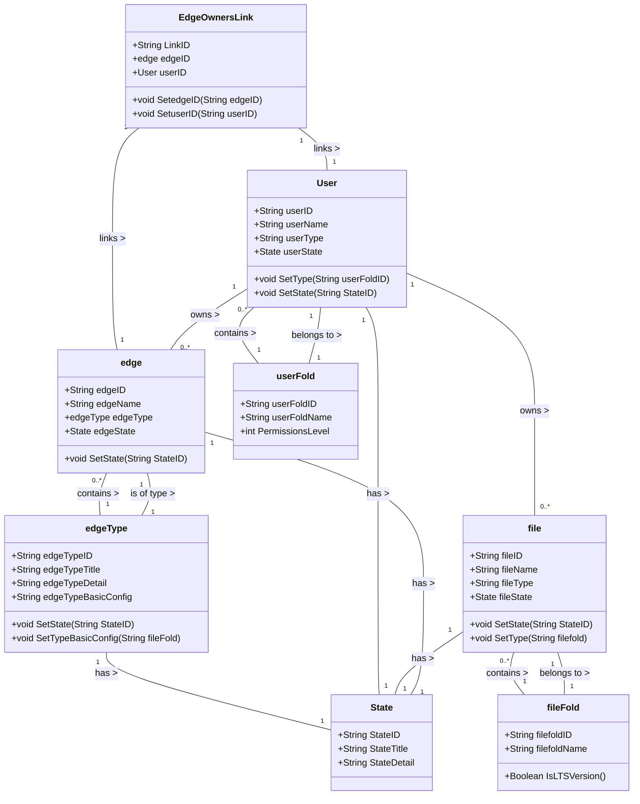

# 功能順序圖(WebUI)

### WebUI使用者登入：

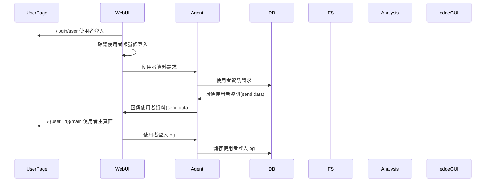

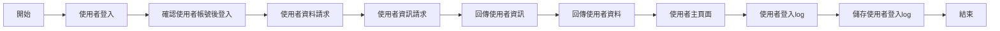

---

WebUI受測者page：

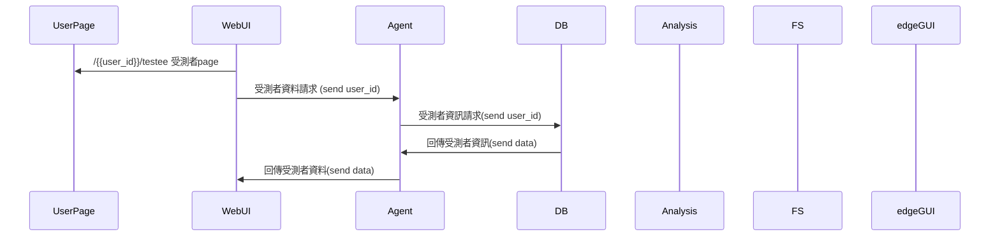

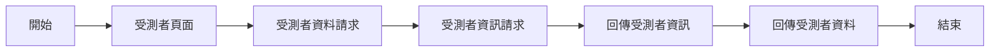

---

### WebUI添加受測者：

link：

- [WebUI受測者page：](https://www.notion.so/WebUI-page-5fdd8d1ebbde48218223c065637705cf?pvs=21)

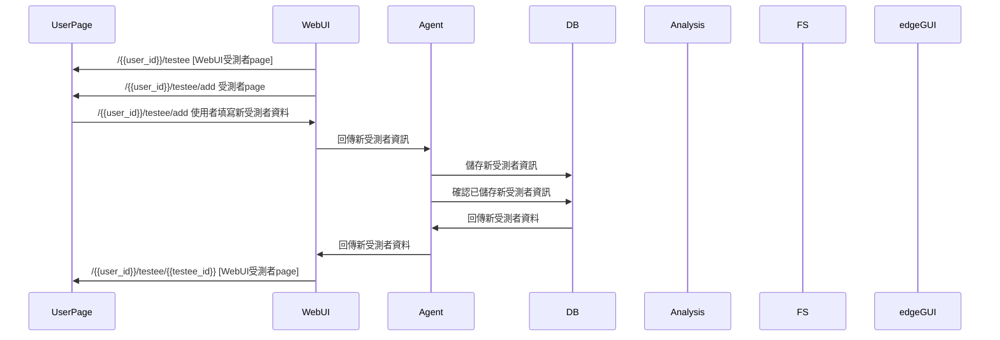

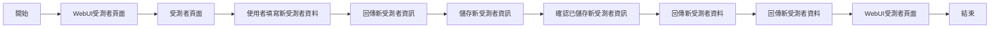

---

### WebUI 查詢測試結果(總覽)：

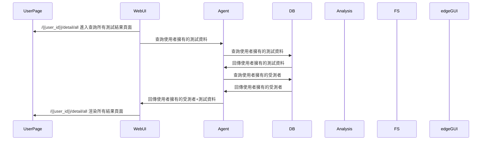

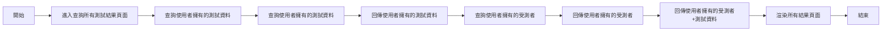

---

### WebUI 查詢測試結果(細節)：

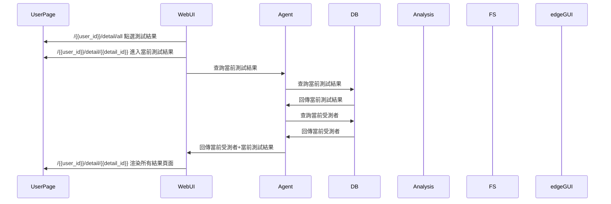

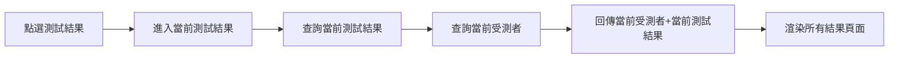
