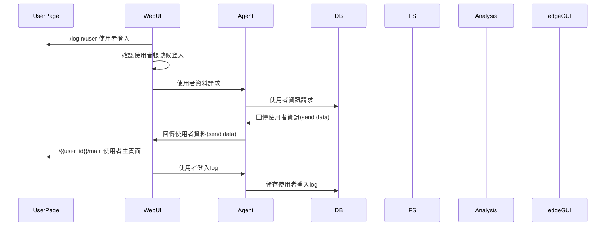
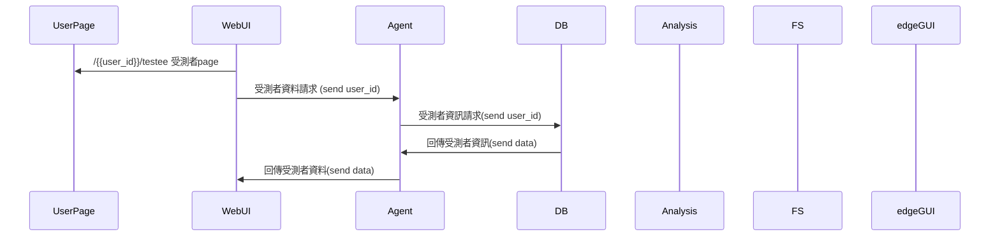
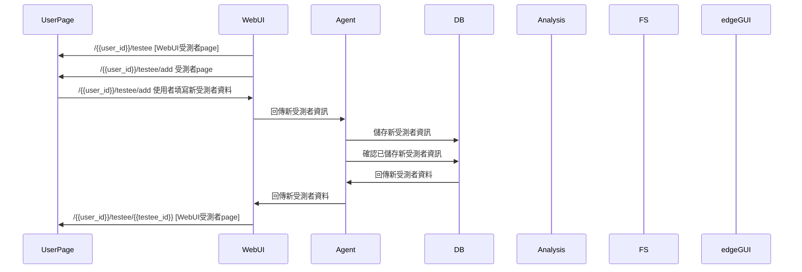
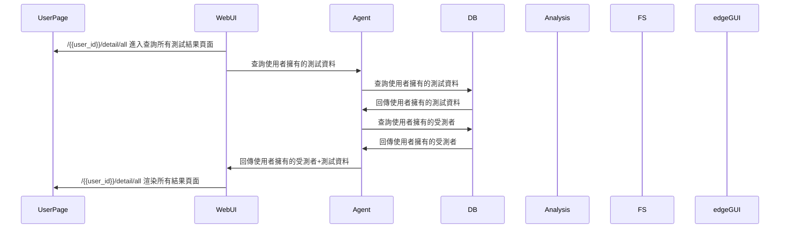
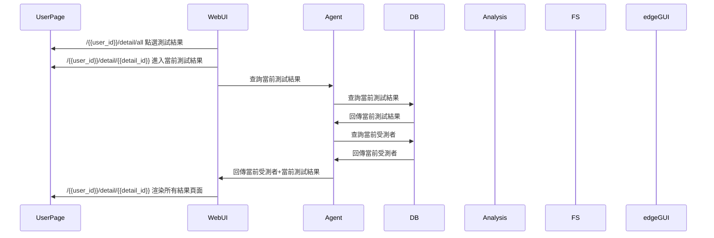
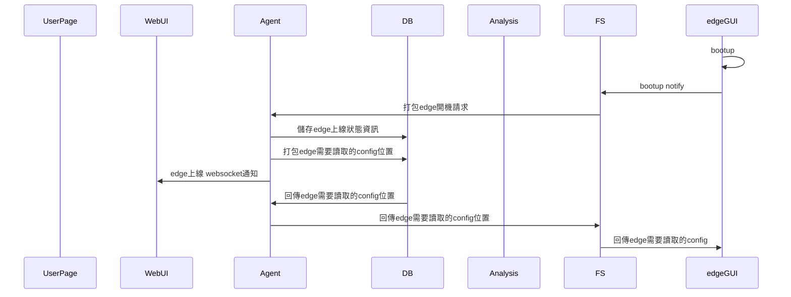
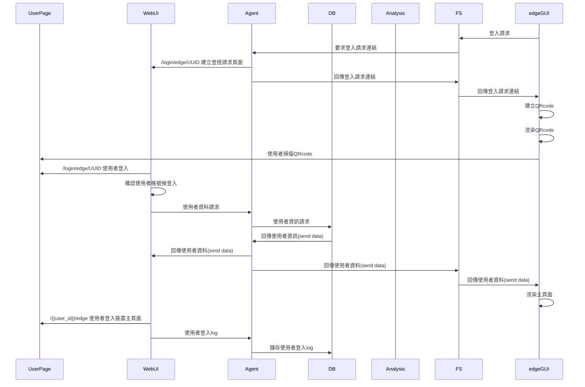
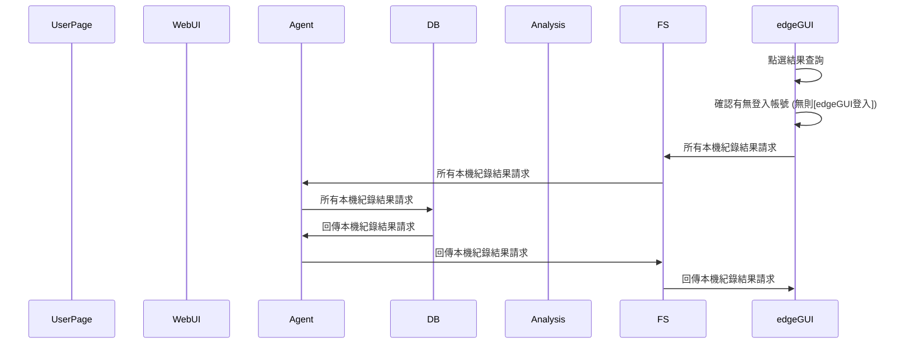
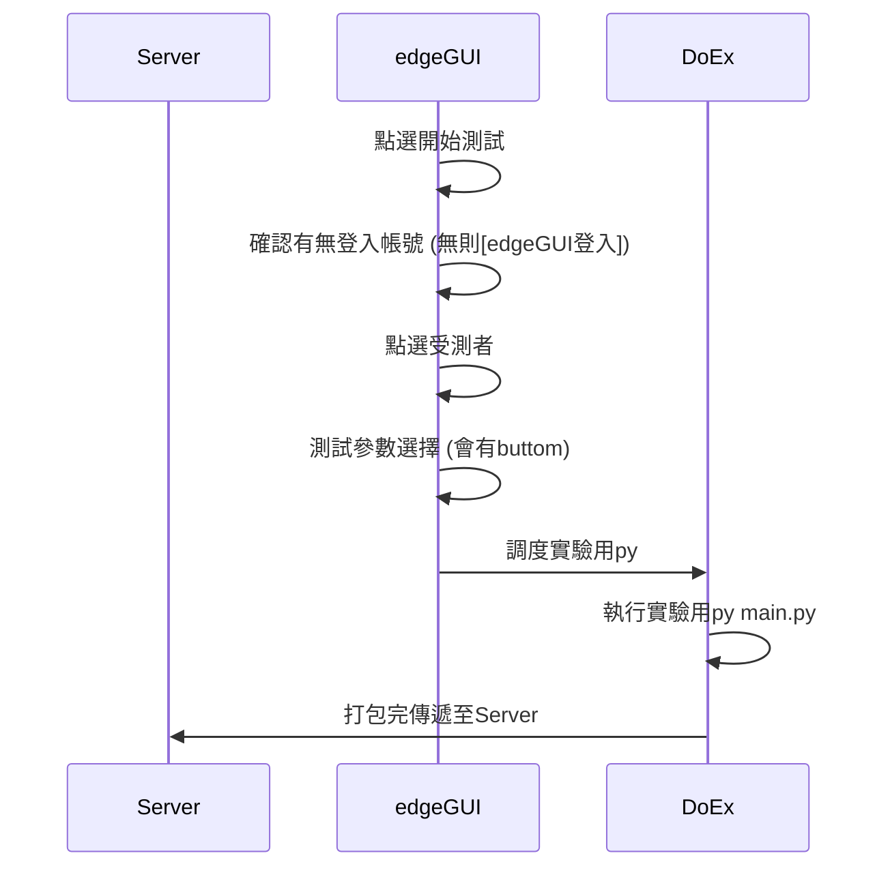
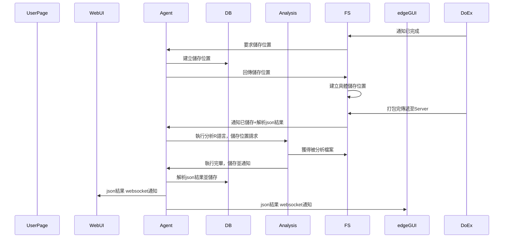

# 功能順序圖(WebUI)
### WebUI使用者登入：

---

### WebUI受測者page：

---

### WebUI添加受測者：

link：

- [WebUI受測者page：](https://www.notion.so/WebUI-page-5fdd8d1ebbde48218223c065637705cf?pvs=21)

---

### WebUI 查詢測試結果(總覽)：

---

### WebUI 查詢測試結果(細節)：

---

### edgeGUI啟動：

---

### edgeGUI登入：

Note: 可以部份沿用WebUI使用者登入

---

### edgeGUI結果查詢：

Note: 可以部份沿用WebUI使用者登入

---

### edgeGUI開始實驗：

link:

- [edgeGUI登入：](https://www.notion.so/edgeGUI-0d1772ae04554b73890852595d6088c6?pvs=21)

